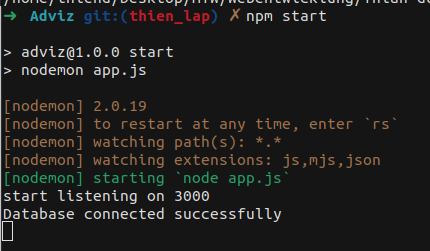
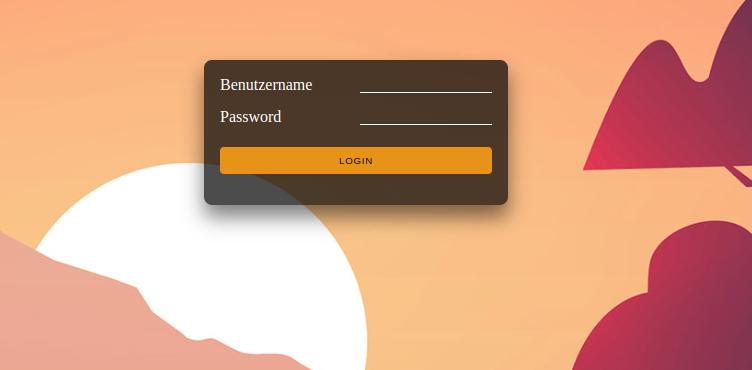
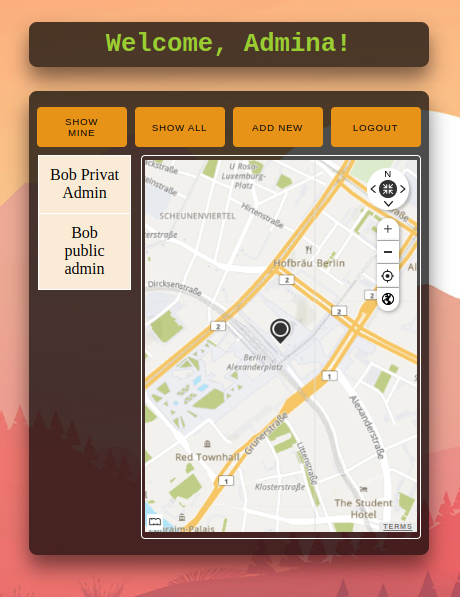

# Adviz Webseite
***
Aviz ist eine Webapplikation, welche basieren auf nodejs und html, css, javascript.

## Literature
1. [Vorbeireitung](#1-vorbeireitung)
* [Nodejs Dependencies](#nodejs-dependencies)
* [Installation](#installation)
* [Collection hinterlegen](#collection-hinterlegen)
* [Projekt starten](#projekt-starten)
2. [Nutzung](#2-nutzung)
* [Login](#login)

### 1. Vorbeireitung
installieren den projekt und gehen zu der Projekt Lokale:
```
./<user>/../Thian-duovog-WAD2022/Adviz

```
#### Nodejs Dependencies
***
um den porjekt zum Laufen zu bringen, müssen Sie ein paar Sachen erledigen. folgen Sie die folgenden Anweisungen.
##### Installation
```
npm install
```
mit diesen Command wird alle nötige Dependencies für den Projekt installiert.
#### Collection hinterlegen
***
mit diesen command kann man erst die `contacts` und `users` collection hinterlegen und Daten hinzufügen.
```
node database.js
```
#### Projekt starten
um den projekt zu starten, benutzen Sie diesen Command:
```
npm start
```
oder 
```
nodemon app.js
```
nach dem diesen Command ausgeführt, wird diesen Output auf Ihren Terminal zeigen


das zeigt, dass der Projekt erfolgreich gestartet ist. 

### 2. Nutzung
***
jetzt öffnen Sie Ihren Browser und geben diesen url `https://localhost:3000` ein.

den Login Seit wird wie Unter angezeigt:


##### Login
***
###### Admin
+ Username: admina
+ Password: password
###### Normalo
+ Username: normalo
+ Password: password

bei falschen Username oder Password: wird Benutzer erwähnt!

wenn Password oder Password sind korrekt, wird Benutzer zu Homepage geleitet: 

###### Welcome Message
Benutzer wird mit admin role `Welcome, Amina` oder mit normalo role  `Welcome, Normalo` gezeigt.

###### Show Mine 
wenn `Show Mine` gedrückt ist, wird alle Kontakte mit gleichen von Benutzer role geben. 
1. Als Amina eingelogt:

2. Als Normalo eingelogt:


###### Show All
* Admina: 
** Alle Kontakte von role `admin` und `normalo` inklusive die private Kontakte werden angezeigt.
+ Normalo: 
** Alle Kontakte von role `normalo` und  nicht private Kontakte von role `admin` werden angezeigt.

###### Add New

###### Update Kontakt

###### Logout

