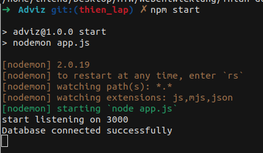
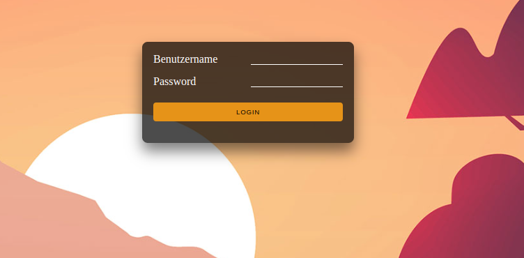
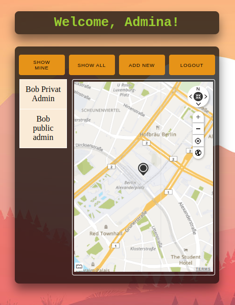
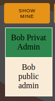
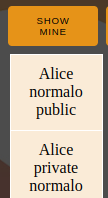
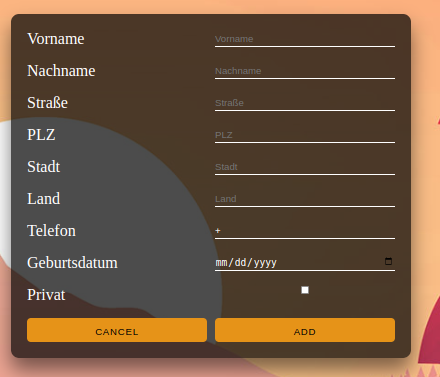
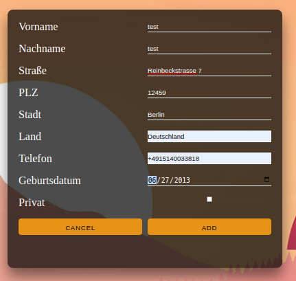
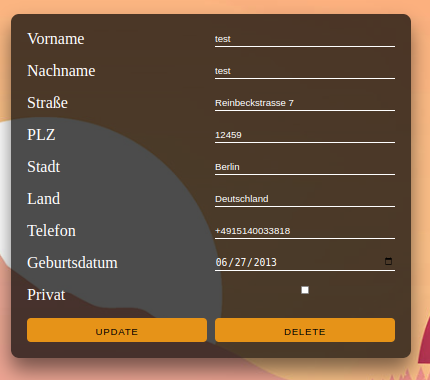

<sup>
Name: Hoang Thien Duong
Matrikelnummer: S0577508
</sup>

# Adviz Webseite
***
Aviz ist eine Webapplikation, welche basieren auf nodejs und html, css, javascript.

## Literatur
1. [Vorbereitung](#1-vorbeireitung)
    * [Nodejs Dependencies](#nodejs-dependencies)
    * [Installation](#installation)
    * [Collection hinterlegen](#collection-hinterlegen)
    * [Projekt starten](#projekt-starten)
2. [Nutzung](#2-nutzung)
    * [Login](#login)
        * [Show Mine](#show-mine)
        * [Show All](#show-all)
        * [Update/delete](#update/delete)

### 1. Vorbereitung
installieren das Projekt und gehen zu der Projektlokale:
```
./<user>/../Adviz

```
#### Nodejs Dependencies
***
- Bevor Sie überhaupt das Projekt anfangen. Müssen Sie sicherstellen, dass Sie schon MongoDB und NPM auf Ihren lokale installiert haben.

- Um das Projekt zum Laufen zu bringen, müssen Sie ein paar Sachen erledigen. Folgen Sie die folgenden Anweisungen.
#### Installation
```
npm install
```
Mit diesem Kommando wird alle nötige Dependencies für das Projekt installiert.
#### Collection hinterlegen
***
Mit diesem Kommando kann man erst die `contacts` und `users` Collection hinterlegen und Daten hinzufügen.
```
mongo localhost:27017/advizDB database.js
```
Wenn dies Befehl nicht funktioniert, probieren sie der untere Befehl:
```
node database.js
```
#### Projekt starten
um das Projekt zu starten, benutzen Sie dieses Kommando:
```
npm start
```
oder 
```
nodemon app.js
```
Nach diesem Kommando ausgeführt, wird diesen Output auf Ihren Terminal zeigen


das zeigt, dass das Projekt erfolgreich gestartet ist. 

### 2. Nutzung
***
Jetzt öffnen Sie Ihren Browser und geben diese URL  [`https://localhost:3000` ](https://localhost:3000) ein.

den Login Seite wird wie unter angezeigt



#### Login
***
##### Admin
+ Username: admina
+ Password: password
##### Normalo
+ Username: normalo
+ Password: password

Bei falschen Username oder Password, wird das angezeigt


wenn Password oder Password sind korrekt, wird Benutzer zu Homepage geleitet


##### Welcome Message

Benutzer wird mit admin role `Welcome, Amina` oder mit normalo role  `Welcome, Normalo` gezeigt.

##### Show Mine 

wenn `Show Mine` gedrückt ist, wird alle Kontakte mit gleichen von Benutzer role geben. 
1. Als Amina eingelogt




2. Als Normalo eingelogt



##### Show All
* Admina: 
Alle Kontakte von role `admin` und `normalo`,  die private Kontakte werden  auch angezeigt.
* Normalo: 
Alle Kontakte von role `normalo` und  nicht private Kontakte von role `admin` werden angezeigt.

##### Add New
wenn Add new gedrückt ist, wird den Add Kontackt Form gezeigt.




Wenn Ausfüllen fertig ist: 



können Sie Add drücken. Kontakt wird in Datenbank gespeichert und Sie werden gleichzeitig an Homepage zurzück geleitet. Von Homepage können Sie entweder auf [Show Mine](#show-mine) oder [Show All](#show-all) drücken, um den neuen Kontakt zu sehen.
##### Update/Delete Kontakt
Von der Homepage können Kontakte sehen und genaue Lokale von allen Kontakte sehen. 
Wenn Sie auf jeweiligen Kontakt drücken, werden Sie zu Update Form gezeigt.

* Hinweis: 
    + Als `normalo` können Sie nur die Kontakte mit ownner als `normalo` ändern(update oder delete).
    + Als `admin` können Sie alle Kontakte ändern(update oder delete). 
    + wenn Sie auf Kontakt drücken, aber nicht geändert haben, können Sie auf  drücken, es wird Ihnen zurück zu Homepage leiten. 
    + Sowie `delete` Button, wird das Kontakt gelöscht. diese wird nicht mehr auf der Karte zeigen.

* wenn Sie Kontakt geändert haben, werden Sie zu Homepage zurzück geleitet. 



#### Logout

mit Logout button können Sie ausloggen und werden Sie zu Login Form gezeigt, damit Sie wieder einloggen können.


#### Map
   + Map wird in Berlin lokalisiert, allerdings kann man auch anderen Adresse für Kontakte geben. Es wird auf der Map auch gezeigt.
   + Wenn Sie eingeloggt sind, der Map wird auch erzeugt.
         * Wenn man auf  `Show Mine` drücke, werden nur eigene Kontakte auf der Map gezeigt. 
         * Wenn man auf  `Show All` drücke, werden alle Kontakte bei der Liste auf der Map gezeigt.
##### Marker
   + Wenn man auf den Marker im Map drückt, kann man Marker Information sehen, dabei wird Name und Adresse des Kontaktes angezeigt.
