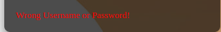

<sup>
name: Hoang Thien Duong
matrikelnummer: S0577508
</sup>

# Adviz Webseite
***
Aviz ist eine Webapplikation, welche basieren auf nodejs und html, css, javascript.

## Literature
1. [Vorbeireitung](#1-vorbeireitung)
* [Nodejs Dependencies](#nodejs-dependencies)
* [Installation](#installation)
* [Collection hinterlegen](#collection-hinterlegen)
* [Projekt starten](#projekt-starten)
2. [Nutzung](#2-nutzung)
* [Login](#login)

### 1. Vorbeireitung
installieren den projekt und gehen zu der Projekt Lokale:
```
./<user>/../Adviz

```
#### Nodejs Dependencies
***
um den porjekt zum Laufen zu bringen, müssen Sie ein paar Sachen erledigen. folgen Sie die folgenden Anweisungen.
#### Installation
```
npm install
```
mit diesen Command wird alle nötige Dependencies für den Projekt installiert.
#### Collection hinterlegen
***
mit diesen command kann man erst die `contacts` und `users` collection hinterlegen und Daten hinzufügen.
```
node database.js
```
#### Projekt starten
um den projekt zu starten, benutzen Sie diesen Command:
```
npm start
```
oder 
```
nodemon app.js
```
nach dem diesen Command ausgeführt, wird diesen Output auf Ihren Terminal zeigen


das zeigt, dass der Projekt erfolgreich gestartet ist. 

### 2. Nutzung
***
jetzt öffnen Sie Ihren Browser und geben diesen url [`https://localhost:3000` ](https://localhost:3000) ein.

den Login Seit wird wie Unter angezeigt


#### Login
***
##### Admin
+ Username: admina
+ Password: password
##### Normalo
+ Username: normalo
+ Password: password

Bei falschen Username oder Password, wird das angezeigt



wenn Password oder Password sind korrekt, wird Benutzer zu Homepage geleitet


##### Welcome Message

Benutzer wird mit admin role `Welcome, Amina` oder mit normalo role  `Welcome, Normalo` gezeigt.

##### Show Mine 

wenn `Show Mine` gedrückt ist, wird alle Kontakte mit gleichen von Benutzer role geben. 
1. Als Amina eingelogt


2. Als Normalo eingelogt


##### Show All
* Admina: 
Alle Kontakte von role `admin` und `normalo` inklusive die private Kontakte werden   angezeigt.
* Normalo: 
Alle Kontakte von role `normalo` und  nicht private Kontakte von role `admin` werden angezeigt.

##### Add New
wenn Add new gedrückt ist, wird den Add Kontackt Form gezeigt.


Wenn Ausfüllen fertig ist: 


können Sie Add drücken. Kontakt wird in Datenbank gespeichert und Sie werden gleichzeitig an Homepage zurzück geleitet. Von Homepage können sie entweder auf [Show Mine](#show-mine) oder [Show All](#show-all) drücken um den neuen Kontakt zu sehen.
##### Update/Delete Kontakt
Von der Homepage können Kontakte sehen und genaue Lokale von allen Kontakte sehen. 
Wenn sie auf jeweiligen Kontakt drücken werden Sie zu Update Form gezeigt.

+ Hinweis: 
    + Als `normalo` können Sie nur die Kontakte mit ownner als `normalo` ändern(update oder delete).
    + Als `admin` können Sie alle Kontakte ändern(update oder delete). 

wenn Sie kontakte geändert haben, werden Sie zu Homepage zurzück geleitet. 


#### Logout

mit Logout button können Sie ausloggen und werden Sie zu Login Form gezeigt, damit Sie wieder einloggen können.


